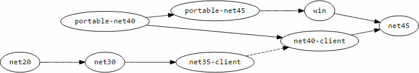

# C# target for ANTLR 4

[](https://gitter.im/tunnelvisionlabs/antlr4cs?utm_source=badge&utm_medium=badge&utm_campaign=pr-badge&utm_content=badge)

[](https://ci.appveyor.com/project/sharwell/antlr4cs/branch/master)

## Getting Started

### Step 1: Install Java (recommended)

> :warning: Starting with release 4.5.0-alpha003, users are no longer required to install the Java Runtime in order to compile .NET applications using ANTLR 4. However, installing Java will dramatically improve the performance of the code generation process. It is highly recommended, especially on developer machines where background code generation is used for IntelliSense functionality.

The C# target for ANTLR 4 uses Java for *compiling* applications. The resulting compiled C# applications will not require Java to be installed. You can install *any* of the following versions of Java to use this target.

If you already have one of the following installed, you should check to make sure the installation is up-to-date.

* Java 7 runtime environment (x86 or x64)
* Java 7 development kit (x86 or x64, provided that the JRE option is also installed during the development kit installation)
* Java 6 runtime environment (x86 or x64)
* Java 6 development kit (x86 or x64, provided that the JRE option is also installed during the development kit installation)

If no suitable version of Java could be located on the machine, the build tools will automatically fall back to using the new C# implementation of the code generation tool instead.

### Step 2: Install ANTLR Language Support for Visual Studio (optional)

This step is optional, but highly recommended for users working with a version of Visual Studio that the extension supports. If you have one of the Express Editions of Visual Studio, or would like to skip this step, move on to the following step.

1. Open Visual Studio
2. Select **Tools** &rarr; **Extensions and Updates...**
3. In the left pane, select **Online**
4. In the top right, type **ANTLR** to search for extensions
5. If your version of Visual Studio is supported, the results pane will show the extension **ANTLR Language Support** by **Sam Harwell**. You can click the result and then select **Download** to install the extension.
6. Restart Visual Studio after installing the extension

### Step 3: Update the NuGet Package Manager

#### For nearly all Visual Studio 2010 and newer installations

1. Open Visual Studio
2. Select **Tools** &rarr; **Extensions and Updates...**
3. In the left pane, select **Updates**, then select **Product Updates**
4. Wait for ~10 seconds while the application checks for updates (it might not notify you that it's checking in the background)
5. If an update for **NuGet Package Manager** is listed in the results, click to update it
6. Repeat steps 3-5 for any other sections listed under **Updates** in the left pane
7. If you updated NuGet, restart Visual Studio before continuing to Step 4 below

#### For Visual Studio 2008, and Visual C# 2010 Express Edition

These versions of Visual Studio do not support the NuGet Package Manager extension, but the C# target for ANTLR 4 does support .NET 2.0 and higher so you should be able to use the [command line NuGet utility](http://docs.nuget.org/docs/start-here/installing-nuget) instead of working directly within Visual Studio.

### Step 4: Install ANTLR 4 support in a C# project
#### For Visual Studio 2017
1. Create or open a C# project which will use ANTLR
2. Right click the top-level solution node in the Solution Explorer window and select **Manage NuGet Packages for Solution...**
3. In the upper left, choose **Browse** and then choose **nuget.org** as the **Package source**
4. Next to the **Search** box, check **Include prerelease**
5. In the **Search** box, type **Antlr4** to search for the package
6. In the search results, locate and select the package called **Antlr4**. Verify that the name is listed as exactly **Antlr4**.
7. In the right pane, select the C# projects you want to use ANTLR4 by clicking their checkboxes
8. Click **Install** under the list of projects
9. Approve changes and accept license agreements, if prompted.

#### For nearly all Visual Studio 2010 - 2015 installations

1. Create or open a C# project which will use ANTLR
2. Right click the top-level solution node in the Solution Explorer window and select **Manage NuGet Packages for Solution...**
3. In the left pane, select **Online**, then select **nuget.org**
4. At the top of the middle pane, if a drop down says **Stable Only**, change the selection to **Include Prerelease**
5. In the top right, type **Antlr4** to search for the package
6. In the search results, locate and select the package called **ANTLR 4**. In the right pane, verify that the **Id** is listed as exactly **Antlr4**.
7. Click install on the search result
8. Select the C# projects you want to add support for ANTLR 4 to, and click **OK** to update those projects

#### For Visual C# 2010 Express Edition

*TODO: This section needs more detail.*

Use the NuGet Package Manager Console to install the latest version of the **Antlr4** package, as described on the following page.

[ANTLR 4](http://www.nuget.org/packages/Antlr4)

#### For Visual Studio 2008

*TODO: This section needs more detail.*

A special NuGet package is available for installation in Visual Studio 2008 projects. You should be able to use the NuGet Package Manager Console to install the latest version of the **Antlr4.VS2008** package, as described on the following page.

[ANTLR 4 (Visual Studio 2008)](http://www.nuget.org/packages/Antlr4.VS2008)

## Working with ANTLR 4 in Visual Studio

The sections below may be performed multiple times in any order as necessary to add and configure the grammars used in your project.

### Add a new grammar to the project

#### Using templates provided by the ANTLR Language Support extension

1. Right click the project (or subfolder) in **Solution Explorer** where the new grammar should be placed
2. Select **Add** &rarr; **New Item...**
3. In the left pane, expand **Visual C# Items** and select **ANTLR**
4. Select one of the ANTLR 4 templates and give it a name, and click **Add** to create the new grammar file and add it to the project

#### Without using the ANTLR Language Support extension

1. Right click the project (or subfolder) in **Solution Explorer** where the new grammar should be placed
2. Select **Add** &rarr; **New Item...**
3. In the left pane, expand **Visual C# Items** and select **General**
4. In the middle pane, select **Text File**
5. In the name box, type the complete name of the grammar file (including the `.g4` extension), e.g. `CustomLanguage.g4`, and click **Add** to create the new file and add it to the project
6. Select **File** &rarr; **Advanced Save Options...**
7. For **Encoding**, select **Unicode (UTF-8 without signature) - Codepage 65001**
8. Click **OK**, and then save the file
9. Add the grammar declaration at the top of the file, e.g. the following for a grammar named `CustomLanguage.g4`

    ```antlr
    grammar CustomLanguage;
    ```

10. Follow step 2 of the *Add an existing grammar to the project* section below to configure the build properties of the newly added grammar file

### Add an existing grammar to the project

The steps for adding an existing grammar to a project are similar for users with and without the ANTLR Language Support extension installed. The primary difference between these cases involves configuring the grammar to generate C# code during the build process, a step which is automated when the ANTLR Language Support extension is installed.

1. Add the **\*.g4** grammar file to the C# project using one of the following methods.
   * Right click the project or folder in **Solution Explorer** and click **Add** &rarr; **Existing Item...**
   * Select the project in **Solution Explorer**, and click the toolbar button for **Show All Files**. Then locate the **\*.g4** grammar file within the project structure, right click the file, and select **Include In Project**.
2. *If you have the ANTLR Language Support extension installed, this step is automatically performed.* Otherwise, you will need to right click the grammar file in **Solution Explorer** and select **Properties**. In the properties window, configure the following items.
   * **Build Action**: `Antlr4`
   * **Custom Tool**: `MSBuild:Compile`
   * **Custom Tool Namespace**: The complete name of the namespace you want the generated classes to be located within. The ANTLR Language Support extension configures this field according to the root namespace configured for the C# project combined with the subfolder within the project where the grammar is located.

### Configure the compile-time options for a grammar in the project

The code generation process for ANTLR grammars is configured by setting specific MSBuild properties on the grammar files included in the C# project file. The ANTLR Language Support extension for Visual Studio exposes the customizable properties for easy configuration in the **Properties** pane of Visual Studio, but they can also be manually configured by editing the project file.

*Note:* this section assumes you have already added the grammar file(s) you wish to customize to the project via the steps described above.

The following table describes the properties available for customizing the code generation process for grammars in C# projects.

1. **MSBuild Property**: This is the name of the XML element in the project file responsible for customizing the property
2. **Display Name**: This is the name of the property as it appears in the Visual Studio **Properties** window for users with the ANTLR Language Support extension installed
3. **Value**: The allowed value(s) for the property
4. **Details**: A description of the impact of the property on the build process

| MSBuild Property | Display Name | Value | Details |
| ---------------- | ------------ | ----- | ------- |
| `Abstract` | Abstract Grammar | `True` or `False` | When `True`, the generated lexer and/or parser classes are marked as `abstract`. |
| `ForceAtn` | Force ATN | `True` or `False` | When `True`, the generated parser will use `AdaptivePredict` for all decisions, including LL(1) decisions. |
| `Listener` | Generate Listener | `True` or `False` | When `True`, a parse tree listener interface and base class will be generated for the parLitser. |
| `Visitor` | Generate Visitor | `True` or `False` | When `True`, a parse tree visitor interface and base class will be generated for the parser. |
| `UseInternalAccessModifier` | Use Internal Access Modifier | `True` or `False` | When `True`, the members are not exposed beyond the assembly they are contained within. |
| `IncludeDebuggerNonUserCodeAttribute` | `Include DebuggerNonUserCode attribute` | `True` or `False` | When `True`, each method will have the DebuggerNonUserCode attribute attribute added. |
| `ExcludeClsCompliantAttribute` | `Exclude ClsCompliant attribute` | `True` or `False` | When `True`, the ClsCompliant attribute will not be added. |
#### Using the ANTLR Language Support extension

1. Right click the grammar file in **Solution Explorer** and select **Properties**
2. Locate the property to customize according to the **Display Name** column in the table above
3. Update the value as appropriate

#### Manually editing the project file

1. Right click the project in **Solution Explorer** and select **Unload Project**
2. Right click the project in **Solution Explorer** and select **Edit *ProjectName*.csproj**
3. Locate the XML element for the ANTLR grammar project item, which should look like the following

    ```xml
    <Antlr4 Include="CustomLanguage.g4">
      <Generator>MSBuild:Compile</Generator>
      <CustomToolNamespace>MyProject.Folder</CustomToolNamespace>
    </Antlr4>
    ```

4. Locate an existing XML element according to the **MSBuild Property** column in the table above, or add one if it does not already exist. For example, to generate both the parse tree listener and visitor interfaces and base classes for your parser, update the project item to resemble the following.

    ```xml
    <Antlr4 Include="CustomLanguage.g4">
      <Generator>MSBuild:Compile</Generator>
      <CustomToolNamespace>MyProject.Folder</CustomToolNamespace>
      <Listener>True</Listener>
      <Visitor>True</Visitor>
    </Antlr4>
    ```

5. Save and close the project file
6. Right click the project in **Solution Explorer** and select **Reload Project**

## Assembly Strong Name Policy

Starting with the beta release of version 4.4.1 of the C# target, a new strong name policy is used for this target. The
new policy is designed to make it easy to write libraries referencing a specific target framework (e.g. .NET 4.0), and
then replace the **Antlr4.Runtime.dll** assembly at runtime built for a newer target framework (e.g. .NET 4.5). For
authors of intermediate library, this dramatically simplifies the process of distributing libraries targeting many
target frameworks. The following graph show the supported replacements which retain binary compatibility. Note that the
dashed line represents a currently-untested link in the graph (see
[#91](https://github.com/tunnelvisionlabs/antlr4cs/issues/91)).



### Pre-release Builds

To ensure the highest level of reliability for developers targeting final releases of particular versions of the ANTLR 4
Runtime, pre-release builds use a different strong name key than final builds. Library authors are encouraged to use
strong-named assemblies when referencing the final builds, especially when code is executing in an environment where
other libraries may be referencing ANTLR 4 (e.g. Visual Studio extensions).

While the strong name keys used for the build are included in the repository, users are **strongly discouraged** from
distributing builds of the ANTLR 4 Runtime using a strong name produced by **antlr4.snk**. Failure to follow this rule
will compromise the reliability of the millions of other users using applications that reference ANTLR on a daily basis.

### Example

Suppose a library writer wishes to use ANTLR 4, and produce output which supports the .NET Framework 3.0 and newer,
including the wide selection of targets offered by the Portable Class Library profile 328. In this example library,
also suppose that all referenced dependencies are present in both the .NET Framework 3.0 and Profile 328, so the same
code compiles in both cases without problems. This library writer only needs to produce and distribute two builds of the
library: a `net30` build which is built against the `net30` build of ANTLR 4, and a `portable-net40` build which is
built against the `portable-net40` build of ANTLR 4.

Now suppose an application developer wishes to use the library described previously. This application is a desktop
application targeting .NET 4.5, and the application developer wishes to use the highest-performing available build of
ANTLR 4. By simply installing the previous library from NuGet, an additional reference will automatically be added to
the **Antlr4.Runtime** package. Without additional configuration, the application will build against the
`portable-net40` build of the library and the `net45` build of ANTLR 4. This situation is fully supported (and
recommended), because the Framework Compatibility graph above includes a chain extending from `portable-net40` to
`net45`.

## Grammars

*TODO*

## Custom Token Specifications (*.tokens)

*TODO*

## Generated Code

During the build, generated code for a grammar is placed in the intermediate output directory. By default, this is
**obj\Debug** for debug builds, and **obj\Release** for release builds. These generated files are managed during the
build process:

* The generated files for the current build configuration are automatically included during the compilation process
* If the grammar is renamed or removed, old generated files will be deleted during the next build
* The generated files are removed during a 'clean' operation

The generated files are not intended to be included in source control, so there is no need to copy them to another
location or manually include them in the project. Since each generated type is declared with the `partial` modifier,
users wishing to extend the behavior of the generated code can do so by including a separate file in the project which
has another definition for the `partial` type. When adding files to a project using the templates in the ANTLR Language
Support extension, empty code files for this purpose are created and added to the project automatically.

## Extra Features in the C# Target

*TODO*

## Example Grammars

*TODO*

